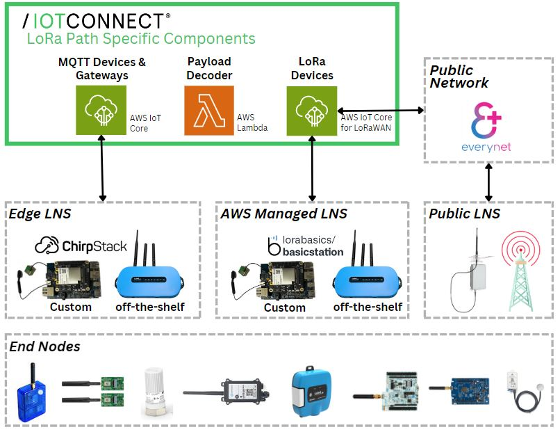

# LoRaWAN and IoTConnect Integration Guide

Welcome to the Gateway and IoTConnect Integration Guide! This repository provides a collection of guides to help you set up and integrate a LoRaWAN gateway with various network servers and IoT platforms. Each guide focuses on a specific aspect of the integration process, from building the gateway firmware to connecting with public networks. Use the links below to access detailed instructions for each integration step.

## Integration Steps

### 1. Connecting a LoRaWAN Device to IoTConnect

This guide provides comprehensive instructions on how to register and connect LoRaWAN devices to IoTConnect. It covers steps for device configuration, network settings, and verifying connectivity. Additionally, it offers guidance on integrating with public LoRaWAN networks such as Everynet to extend connectivity through IoTConnect.

For detailed instructions, see the [Connecting a LoRaWAN Device to IoTConnect Guide](https://github.com/avnet-iotconnect/iotc-lora-demos/blob/master/docs/iotc-lora-device-onboard.md).

### 2. Configure an AWS Managed LNS Gateway

This guide details how to compile and integrate the BasicStation protocol into the LoRaWAN gateway. BasicStation is a modern, secure, and flexible protocol for connecting gateways to network servers.

For detailed steps, refer to the AWS Managed LNS Gateway Guide.

### 3. Configure an Edge LNS Gateway

This repository does not focus on setting up Edge LNS Gateways. For comprehensive guidance on configuring a LoRaWAN gateway using ChirpStack with the LoRa Network Server (LNS) running directly on the gateway, please refer to the dedicated guide in the IoTConnect GitHub repository:

Visit the [Edge LNS Gateway Guide](https://github.com/avnet-iotconnect/iotc-lora-gateway-example).

### 4. Optional Advanced Guide: Setting Up LoRa Basics Station on STM32MP157DK

For advanced users interested in a detailed build process using Yocto, see the optional guide Setting Up LoRa Basics Station on STM32MP157DK.

-   **Create a Docker Build Machine**  
    This optional step is part of the advanced guide. Learn how to set up a Docker-based build environment for compiling gateway firmware and tools. This setup ensures a consistent and controlled development environment.
    
    For step-by-step instructions, see the Docker Build Machine Guide.
    

## Getting Started

To begin, select the guide that matches your setup or the integration you wish to achieve. Each document is comprehensive and standalone, offering all the necessary steps and information for successful integration.

For further assistance or inquiries, please refer to the respective document or contact our support team.

## Detailed Guides

### LoRaWAN Gateway Setup and Onboarding into IoTConnect

For a step-by-step guide on creating and configuring a LoRaWAN gateway in IoTConnect, see iotc-gateway-onboard.md.

### LoRa Device Onboarding into IoTConnect

To understand how to add and manage your LoRaWAN devices in IoTConnect, refer to [iotc-lora-device-onboard.md](https://github.com/avnet-iotconnect/iotc-lora-demos/blob/master/docs/iotc-lora-device-onboard.md).

## Additional Resources

### IoTConnect Documentation

For the most detailed and up-to-date information, please visit the [IoTConnect Documentation](https://docs.iotconnect.io/iotconnect/user-manuals/devices/device/lorawan/).

This comprehensive resource provides extensive details on integrating LoRaWAN devices and gateways into IoTConnect, including best practices, troubleshooting tips, and advanced configuration options.
